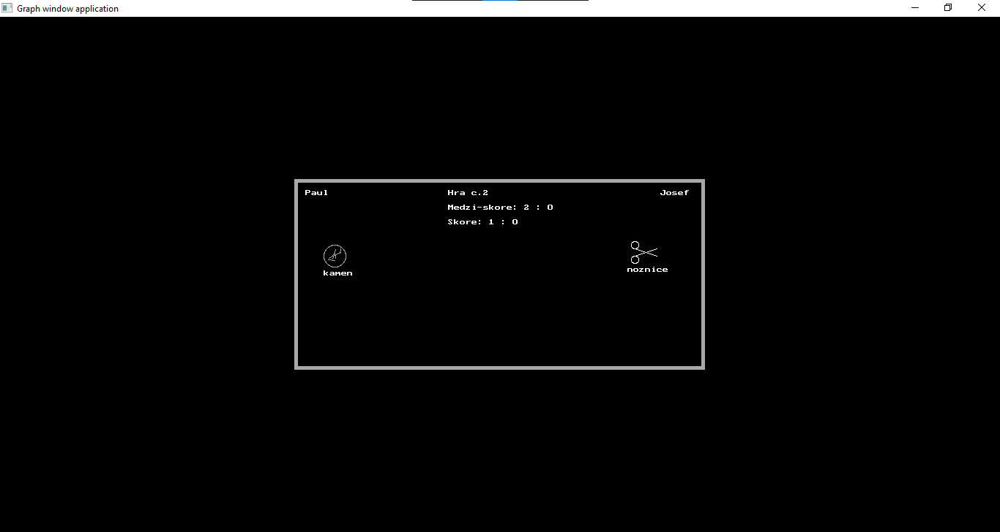

# Rock, Paper, Scissors Game

This Pascal program simulates the classic Rock, Paper, Scissors game between two players. The game consists of multiple rounds, and each round involves both players making a choice among rock, paper, or scissors. The winner of each round is determined based on the choices made by the players.

## Features

### Player Initialization

-   The program allows players to enter their names before starting the game.

### Game Rounds

-   Each game consists of multiple rounds, where players make their choices (rock, paper, or scissors).
-   The program visually displays the choices made by each player.

### Scoring

-   The program keeps track of the number of rounds won by each player.
-   It displays the overall score and the score of the ongoing game.

### Game Outcome

-   After each round, the winner of that round is determined based on the game rules.
-   The overall winner of the game is declared based on the cumulative round victories.

### Play Again

-   After completing a game, players have the option to start a new game or exit the program.

## Usage

1. **Run the Program:**

    - Execute the program, and it will prompt you to enter the names of the two players.

2. **Game Rounds:**

    - The game proceeds with rounds where players make their choices (rock, paper, or scissors).
    - The program displays the choices and announces the winner of each round.

3. **Scoring:**

    - The overall score and the score of the ongoing game are displayed after each round.

4. **Game Outcome:**

    - After completing a game, the program declares the overall winner based on cumulative victories.

5. **Play Again:**
    - Players can choose to start a new game or exit the program.

## Example Output

Player 1: John
Player 2: Jane

Game 1: John vs. Jane

Round 1 - John's Choice: Rock, Jane's Choice: Paper
Winner: Jane

Round 2 - John's Choice: Scissors, Jane's Choice: Scissors
It's a Tie!

Round 3 - John's Choice: Paper, Jane's Choice: Rock
Winner: John

Game Outcome: John: 1, Jane: 1

Do you want to play again? (y/n): n

Summary:
Player John - Total Rounds Won: 1, Total Games Won: 0
Player Jane - Total Rounds Won: 1, Total Games Won: 0

## Screenshots

Feel free to enjoy multiple games and explore different strategies to outsmart your opponent!
